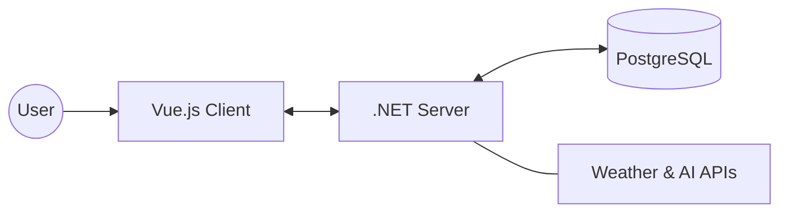

# ☁️ Atmosphere

> A robust, full-stack weather intelligence platform featuring real-time forecasts, AI-driven insights, and user personalization.

**Atmosphere** is a modern, containerized application built to deliver precise weather data and AI-powered recommendations. Version 2.0 introduces a completely overhauled architecture using microservices, Docker orchestration, and a PostgreSQL database.

## 📸 Screenshots

| Login & Security | Sanctuary & Search |
|:---:|:---:|
|  |  |

### AI Insights & Detailed Forecast


---

## 🚀 Tech Stack

* **Frontend:** Vue.js 3 + Vite (TypeScript)
* **Backend:** .NET 10 Web API
* **Database:** PostgreSQL 15
* **Infrastructure:** Docker Compose & Nginx (Reverse Proxy)
* **AI Integration:** Groq, Gemini, Cerebras
* **Data Source:** OpenWeatherMap API

---


## ✨ Key Features

- **AI-Powered Briefings:** Natural language summaries of the weather (e.g., "It's a warm and humid day...") rather than just raw numbers.
- **Lifestyle Recommendations:** Smart suggestions for outfits (e.g., "Cotton tee with lightweight trousers") and activities.
- **Sanctuary Mode:** Save and monitor your primary locations (e.g., Zurich, Dubai) for instant access.
- **Detailed Metrics:** Real-time tracking of UV Index, AQI, Humidity, and Visibility.

---

## 🏗️ Architecture (v2.0)

Atmosphere runs on a 3-container architecture orchestrated by Docker Compose. The Nginx container acts as the entry point, routing traffic to the frontend or backend as needed.


- **weather-web:** Nginx container serving the Vue.js frontend(Client).
- **weather-api:** .NET 8 backend(Server) handling logic, AI processing, and third-party API calls.
- **weather-db:** Persistent PostgreSQL storage for user accounts and preferences.

---

## 🛠️ Quick Start (Docker)

The easiest way to run the full stack is via Docker. This ensures all dependencies (Database, API, Frontend) are configured automatically.

### 1. Installation
```bash
# Clone the repository
git clone https://github.com/rahulrr-coder/atmosphere.git
cd atmosphere

# Setup Environment Variables
cp .env.example .env
```

Open `.env` and fill in your API keys (OpenWeather, Groq, etc.) and database credentials.

### 2. Run with Docker
```bash
# Build and start all services in detached mode
docker compose up -d --remove-orphans
```

### 3. Docker Utilities

Manage your containerized environment with these commands:

| Action | Command | Description |
|--------|---------|-------------|
| **Start** | `docker compose up -d` | Starts the app in the background. |
| **Stop** | `docker compose stop` | Stops running containers without removing them. |
| **Down** | `docker compose down` | Stops and removes containers/networks. |
| **Logs** | `docker compose logs -f` | View real-time logs for all services. |
| **Rebuild** | `docker compose up -d --build` | Rebuilds images after code changes. |

---

## 🌍 Access Points (Docker)

- **Frontend:** http://localhost:5173
- **Backend:** http://localhost:5160/swagger

---

## 🧪 Local Development (Manual)

If you prefer to run the services individually without Docker (e.g., for debugging), follow these steps.

### Prerequisites

- Node.js (v18+)
- .NET 8 SDK
- PostgreSQL running locally

### 1. Database Setup

Ensure your local PostgreSQL instance is running. Update the connection string in `server/appsettings.json` to point to your local DB.

### 2. Start the Backend (Server)
```bash
cd server
dotnet restore
dotnet run
```

The API will start at http://localhost:5160.

### 3. Start the Frontend (Client)

Open a new terminal:
```bash
cd client
npm install
npm run dev
```

The frontend will run at http://localhost:5173.

---

## 📦 Database & Migrations

The application automatically applies migrations on startup. If you need to access the database manually:

- **Host:** localhost
- **Port:** 5432 _(Note: If port 5432 is busy, update the ports mapping in `docker-compose.yml`)_
- **User/Pass:** (As defined in your `.env` file)

---

## 📄 License

This project is licensed under the MIT License.